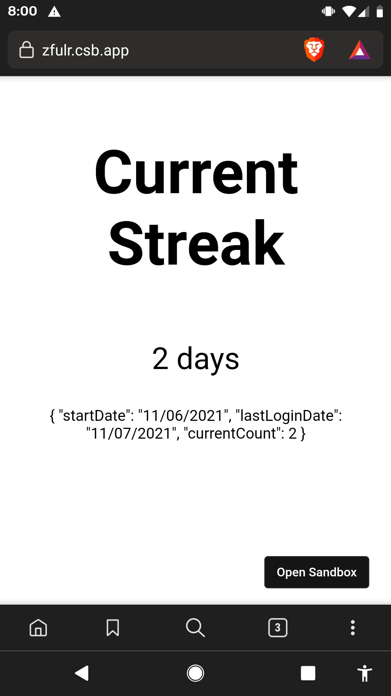

# Streak Counter

This is a basic streak counter - inspired by Duolingo - written in TypeScript and meant for the browser (uses `localStorage`).

## Usage

```typescript
import { useStreak } from "use-streak";

const today = new Date();
const streak = useStreak(localStorage, today);
// streak returns an object:
// {
//    currentCount: 1,
//    lastLoginDate: "11/11/2021",
//    startDate: "11/11/2021",
// }
```



[](https://codesandbox.io/s/vigorous-wood-o8m7w?fontsize=14&hidenavigation=1&theme=dark)

## LICENSE

MIT. Just make sure you give acknowledgements to this repo.
